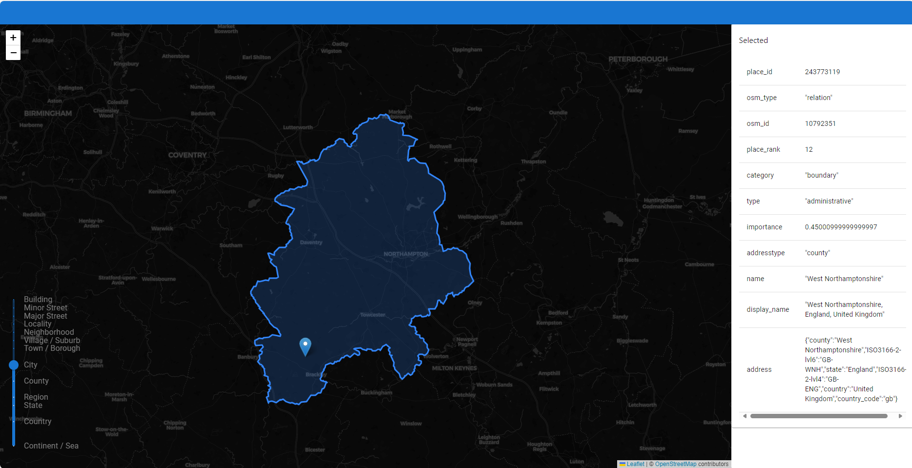

# Nominatim Paint
This web app is meant more of a tool to query nominatim api to get geospatial data for locations by interacting with a map, This was intended to give me some experience working with geojson data, aswell as a template for a web app that will allow me to test API for my 'Been there done that' Api.

## Tech stack
- React
- Zustand
- MUI
- Leaflet

## Site demo: https://nominatimpaint.netlify.app/

## Features

### Map Interaction
- Interactive map with click-to-select functionality
- Adjustable zoom level slider to control the detail level of selected regions
- Marker placement to indicate selected locations

### GeoJSON Selection
- Retrieve GeoJSON data for locations by clicking on the map
- View detailed properties of selected GeoJSON features
- Customize the color of individual selections
- Copy GeoJSON data to clipboard with a single click

### Group Management
- Create named groups to organize multiple GeoJSON selections
- Add selected areas to groups to build custom multipolygons
- Manage group members with add/remove functionality
- Each group can have its own distinct color for visual separation
- Copy entire groups as complete GeoJSON FeatureCollections

### Visual Customization
- Color picker for individual selections
- Independent color customization for each group
- Visual indication of active groups and selections on the map

## Screenshots

## Planned Features

- Save session selections for persistence between visits
- Manual GeoJSON text input for importing external data